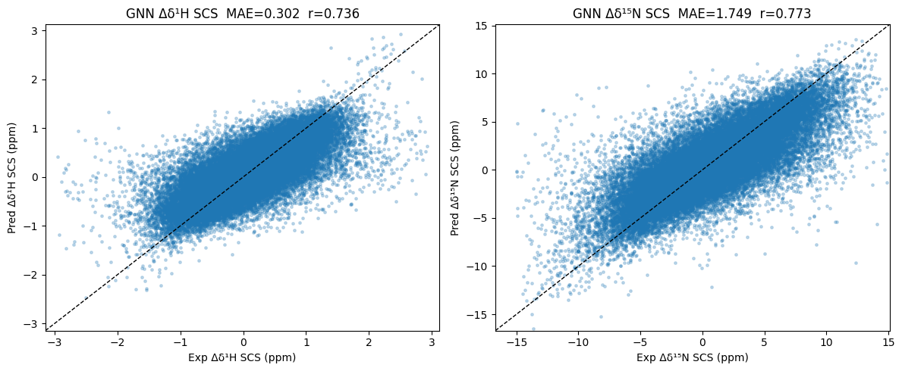
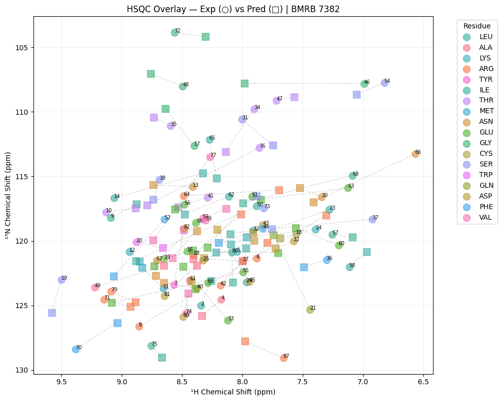

<div align="center">

# NMR-HSQC-GNN
### AI-Driven Prediction of Protein Backbone Chemical Shifts from 3D Structure

[](https://python.org)
[](https://pytorch.org)
[](https://pyg.org)
[](LICENSE)
[](https://colab.research.google.com)

**Structural Biology × Deep Learning × Drug Discovery**

[Results](#results) · [Architecture](#model-architecture) · [Pipeline](#data-pipeline) · [Quick Start](#quick-start) · [Roadmap](#roadmap)

</div>

---

## The Problem This Solves

In structure-based drug discovery, predicting **how a protein will appear in an NMR spectrum** directly from its 3D coordinates is a bottleneck in:

- ✅ **Validating computationally designed proteins** (AlphaFold outputs, RFdiffusion designs)
- ✅ **Guiding NMR resonance assignment** without time-consuming experiments
- ✅ **Cross-validating MD simulation trajectories** against experimental observables
- ✅ **Screening protein–ligand binding** by predicting chemical shift perturbations

This project implements an end-to-end AI pipeline that predicts **backbone ¹H and ¹⁵N secondary chemical shifts** from protein structure using a GATv2-based graph neural network — achieving performance comparable to SPARTA+, the current industry standard, while being fully trainable and extensible.

---

## Results (v11 · Test Set · 620 proteins)

| Model | ¹H MAE | ¹⁵N MAE | r ¹H | r ¹⁵N |
|-------|--------|---------|------|-------|
| **GNN (this work)** | **0.302 ppm** | **1.749 ppm** | **0.736** | **0.773** |
| MLP baseline | 0.416 ppm | 2.333 ppm | 0.476 | 0.602 |
| SPARTA+ (literature) | ~0.25 ppm | ~1.80 ppm | ~0.90 | ~0.88 |

> Graph structure accounts for **~25% improvement** over sequence-only baseline, confirming that 3D structural context — H-bond geometry, ring currents, inter-residue distances — is effectively captured by message passing.

<p align="center">
  
</p>

<p align="center">
  
</p>

---

## Why This Project Demonstrates Applied AI in Drug Discovery

This project was built end-to-end — from raw BMRB/PDB data through model deployment — addressing real scientific and engineering challenges:

| Challenge | Solution | Impact |
|-----------|----------|--------|
| BMRB referencing noise in labels | Pairwise Patterson-style loss (v2.0) | Training signal made referencing-invariant |
| Paramagnetic metal contamination | Physics-based HETATM filter | Removed ~2% corrupted training entries |
| BMRB–PDB residue number mismatch | ±10 offset alignment search | Skip rate reduced from 44% → 28% |
| ¹⁵N loss dominated by outliers | Per-head log-cosh loss + SCS filter | ¹⁵N MAE improved from 3.07→1.75 ppm |
| Graph edge sparsity | Sequence + spatial + H-bond edge types | r improved from 0.43→0.74 across versions |

---

## Model Architecture

```
Input: protein 3D structure (PDB)
  └─ Node features [N, 85]:
       Geometry (43): backbone dihedrals φ/ψ/ω + χ angles + Cβ direction
                      + neighbour aa-type embeddings (i±1)
       Physics  (26): ring current · SASA · H-bond geometry · n→π* interaction
                      · electrostatics · AM1 charges · ensemble RMSD
       Metal    ( 6): Zn/Ca/Mg/Na/K coordination flags + distance [v11 new]
       Ligand   ( 4): ring current + electrostatics + proximity + contact [v11 new]
       Dynamics ( 9): S² · Rex · τe · B-factors · disorder propensity
  └─ Edge features [E, 37]:
       Sinusoidal sequence encoding (8) + RBF distance (16)
       + local frame direction (3) + relative orientation (6) + bond type (4)

GATv2Conv × 4 layers  (hidden=256, 4 heads, dropout=0.2)
  + learnable aa-type embedding (Embedding(21,8) → Linear(24,256))
  + per-residue-type output bias (Embedding(20,2))

Output: [N, 2] — secondary chemical shifts Δδ¹H and Δδ¹⁵N (ppm)
        normalised during training; denormalised to ppm at evaluation

Parameters: ~862,000
```

**Key design decisions grounded in structural biology:**
- **Ring current model:** Haigh-Mallion `Δδ = Σ B(1−3cos²θ)/r³` — the dominant contributor to ¹H shifts in folded proteins
- **GATv2 attention heads:** Learn differential weighting of H-bond partners vs. distant spatial contacts
- **Sinusoidal sequence encoding:** Explicitly encodes i→i+4 helical periodicity without learned positional embeddings
- **i±1 neighbour type embedding:** Encodes the known ±5 ppm ¹⁵N dependence on preceding residue type (Wang & Jardetzky 2004)

---

## Data Pipeline

```
BMRB REST API ──► 8,712 entries with linked PDB IDs
                        │
                        ▼
         ┌──────────────────────────────┐
         │  Data Quality Filters        │
         │  • Paramagnetic metal filter │  ← Fe/Co/Ni/Cu/Mn removed
         │  • ±10 residue offset align  │  ← BMRB↔PDB numbering fix
         │  • SCS outlier filter        │  ← |ΔδH|>3 or |ΔδN|>15 ppm
         └──────────────────────────────┘
                        │
                        ▼
         Physics feature extraction (CPU)
         ├─ FreeSASA   → solvent accessibility
         ├─ pdbfixer   → hydrogen completion
         ├─ BioPython  → backbone dihedrals, local frames
         └─ Custom     → ring current, H-bond geometry,
                         n→π* interactions, metal coordination

                        │
                        ▼
         graphs.pkl  (Drive cache, auto-invalidated on config change)
                        │
                        ▼
         70 / 20 / 10 protein-level split
         (4,286 train · 1,224 val · 612 test)
                        │
                        ▼
         GATv2 training on T4 GPU (~3 hours)
```

**Reproducibility:** The `CACHE_VERSION` string encodes all feature flags. Changing any feature dimension or data filter automatically invalidates and rebuilds the graph cache.

---

## Version History & Learning Trajectory

| Version | ¹H MAE | ¹⁵N MAE | r ¹H | r ¹⁵N | Key contribution |
|---------|--------|---------|------|-------|-----------------|
| v5 | 0.470 | 3.065 | 0.43 | 0.31 | Proof of concept · 56 proteins |
| v6 | 0.318 | 1.801 | 0.72 | 0.77 | Physics features + 4,337 proteins ★ |
| v7 | 0.361 | 1.988 | 0.63 | 0.73 | DropEdge identified as harmful |
| v8 | 0.207 | 6.587 | 0.71 | 0.77 | Learned aa embeddings (¹⁵N broken by A2) |
| v9 | 0.311 | 1.775 | 0.73 | 0.78 | Stable best · aa embeddings + sinusoidal edges |
| v10 | 0.303 | 1.740 | 0.735 | 0.776 | Metal coordination features · para filter |
| **v11** | **0.302** | **1.749** | **0.736** | **0.773** | **Ligand features · full v10 validated** |
| v2.0 | — | — | — | — | Referencing-invariant loss (Patterson · Fourier · LoG) |

> Each version addressed a specific scientific or engineering hypothesis. Failures (v7 DropEdge, v8 A2 centering) were as informative as successes.

---

## Referencing-Invariant Loss Functions (v2.0 — In Progress)

A key insight: **BMRB referencing errors are global spectral translations**. The pairwise distance between any two peaks is preserved regardless of which reference standard was used. Version 2.0 exploits this with three complementary loss terms:

```
Total loss = λ₀ · L_log-cosh          # primary per-residue loss
           + λ_A · L_Fourier           # Plan A: |FFT(HSQC)|² comparison
           + λ_B · L_Patterson         # Plan B: pairwise Δδ differences
           + λ_C · L_LoG              # Plan C: multi-scale 2D conv image loss
```

This is the NMR analogue of the **crystallographic Patterson function** (Patterson 1934) — which solved the phase problem in X-ray diffraction by working entirely with observable intensities rather than unmeasurable phases.

---

## Quick Start

### Predict chemical shifts for a new protein

```python
# Load trained model and predict on any PDB file
df = predict_pdb("my_protein.pdb", gnn_model, is_gnn=True)

# Output DataFrame:
#   chain · seq_id · res_name
#   pred_1H_scs · pred_15N_scs    ← secondary shifts (ppm)
#   pred_1H_abs · pred_15N_abs    ← absolute shifts (ppm)
```

### Run on Google Colab (recommended)

1. Open `nmr_hsqc_colab_v11.ipynb` in Google Colab
2. **Runtime → Change runtime type → T4 GPU**
3. Edit the `USER CONFIG` cell: set `DRIVE_ROOT` to your Google Drive path
4. Run all cells — data downloads, graph building, and training are fully automated

> **CPU pre-processing:** Graph building (~3 hours) runs on CPU. The notebook pauses with a clear prompt to switch to T4 GPU before training begins.

### Key configuration flags

```python
# Feature toggles (auto-invalidate cache when changed)
FEATURE_LEVEL        = "HIGH_MED"   # HIGH | HIGH_MED | ALL
FILTER_PARAMAGNETIC  = True         # remove Fe/Co/Ni/Cu/Mn entries
USE_METAL_FEATURES   = True         # +6 node dims: Zn/Ca/Mg/Na/K
USE_LIGAND_FEATURES  = True         # +4 node dims: ring/elec/dist/contact

# v2.0 referencing-invariant losses
USE_PLAN_A_FOURIER   = True   # Fourier power spectrum
USE_PLAN_B_PATTERSON = True   # Patterson pairwise differences
USE_PLAN_C_CONV      = True   # LoG convolutional image
```

---

## Installation

```bash
# Python 3.10+
pip install torch torchvision --index-url https://download.pytorch.org/whl/cu118
pip install torch-geometric torch-scatter torch-sparse \
    -f https://data.pyg.org/whl/torch-2.0.0+cu118.html
pip install biopython pynmrstar freesasa pdbfixer openmm \
    scipy scikit-learn pandas matplotlib seaborn tqdm requests
```

---

## Data Sources

| Resource | URL | Content |
|----------|-----|---------|
| BMRB | https://bmrb.io | Chemical shift assignments (8,712 entries) |
| RCSB PDB | https://rcsb.org | 3D protein structures |
| BMRB→PDB mapping | `https://api.bmrb.io/v2/mappings/bmrb/pdb` | Entry cross-references |

---

## Roadmap

- [ ] **LACS re-referencing** — correct systematic BMRB referencing offsets during preprocessing
- [ ] **POTENCI random-coil corrections** — sequence-context-dependent RC values (pH/T-aware)
- [ ] **v2.0 training run** — validate referencing-invariant loss on full dataset
- [ ] **ESM2 embeddings** — add protein language model features as additional node context
- [ ] **MD-averaged structures** — replace static PDB with ensemble-averaged coordinates

---

## Scientific Background

NMR chemical shifts are sensitive reporters of local protein structure and dynamics. The backbone amide **¹H shift** is dominated by hydrogen-bond geometry and aromatic ring currents; the **¹⁵N shift** encodes φ/ψ dihedral angles and is strongly modulated by the identity of the preceding residue (±5 ppm effect).

Accurate prediction enables structure validation and cross-referencing with other structural data sources — critical in the drug discovery workflow where computational models (AlphaFold, RFdiffusion, Rosetta) must be benchmarked against experimental NMR data.

---

## Citation

```bibtex
@misc{nmr-hsqc-gnn,
  title   = {NMR-HSQC-GNN: Graph Neural Network for Protein Amide Chemical Shift Prediction},
  year    = {2025},
  url     = {https://github.com/[your-username]/nmr-hsqc-gnn},
  note    = {GATv2-based model trained on 4,286 BMRB/PDB entries.
             v11: MAE ¹H=0.302 ppm, MAE ¹⁵N=1.749 ppm}
}
```

**Key references:**
- GATv2: Brody et al. (2022) *ICLR*
- Ring current model: Haigh & Mallion (1979) *Progress in NMR Spectroscopy*
- Random coil SCS: Kjaergaard & Poulsen (2011) *J. Biomol. NMR*
- SPARTA+: Shen & Bax (2010) *J. Biomol. NMR*
- ¹⁵N preceding residue effect: Wang & Jardetzky (2004) *J. Biomol. NMR*
- Patterson function: Patterson (1934) *Physical Review*

---

<div align="center">
<sub>Built with structural biology domain expertise · PyTorch · PyTorch Geometric · Google Colab</sub>
</div>
